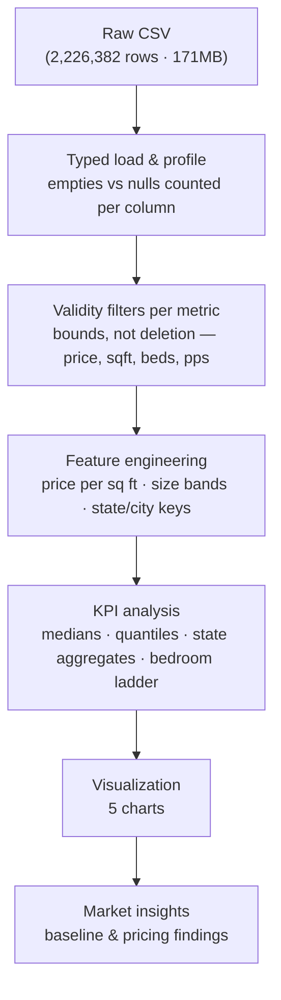

# USA Real Estate — Market & Data-Quality Analysis

**2,226,382 listings · 12 columns · one 171MB CSV → the market baseline: $325K median price, $201 median per sq ft.**


A data analysis of the US housing market built from a single raw export of 2.2 million
real-estate listings — price, house size, geography, and property mix — cleaned and
profiled with Python, Pandas, and Matplotlib. Every number on this page is produced by a
script in this repository, run against the source CSV.

> [!NOTE]
> **Why this stands out:** this is a raw-data project, and the data is genuinely messy —
> 25.5% of house sizes missing, a street column that is 99.5% numeric junk, prices running
> from $0 to an int32 overflow artifact (2,147,483,600). The analysis turns that mess into
> a usable market baseline without inventing a single value, and it proves two
> counter-intuitive findings: the mean price ($524K) is 61% above the median ($325K), and
> price per square foot *falls* as homes get bigger — location, not size, drives value.

## Table of Contents

1. [Executive Summary](#executive-summary)
2. [Business Problem](#business-problem)
3. [Headline KPIs](#headline-kpis)
4. [Dataset](#dataset)
5. [Analysis Pipeline](#analysis-pipeline)
6. [Key Insights](#key-insights)
7. [Business Recommendations](#business-recommendations)
8. [Engineering Decisions](#engineering-decisions)
9. [Repository Structure](#repository-structure)
10. [Quick Start](#quick-start)
11. [Interactive Dashboard](#interactive-dashboard)
12. [Known Limitations](#known-limitations)
13. [About the Author](#about-the-author)

---

## Executive Summary

A 171MB CSV of 2,226,382 US housing listings is not a market view — it is raw material.
This project cleans and profiles it into one: **$325K median listing price, $201 median
price per square foot, a 3.8× state price spread (California $669K vs Ohio $174.9K), and a
bedroom ladder that prices configurations from $269K (1 bed) to $950K (7 beds).**

The workflow is a single reproducible pipeline: `scripts/analyze_data.py` computes every
KPI and writes a JSON report; `scripts/generate_charts.py` renders the visualizations from
the same pipeline. Run both, get this analysis. No database, no dashboard tool, no
hand-made figures.

> [!IMPORTANT]
> **Verification:** every figure in this README is the output of `scripts/analyze_data.py`
> executed against `data/realtor-data.zip.csv`. The scripts are the source of truth; this
> document quotes them.

## Business Problem

Real estate professionals need a reliable picture of what homes cost, where, and at what
size. The raw export is a classic raw-data trap: complete enough to look trustworthy,
messy enough to mislead. Empty fields masquerade as data, junk values hide in text
columns, and extreme prices distort any naive calculation — 280 rows at $0, 3,996 above
$10M, and a maximum of 2,147,483,600 (an int32 overflow artifact).

The problem is twofold: **clean the data without inventing values**, and **pick statistics
that survive the skew**. The mean price ($524,261) is 61% above the median ($325,000) —
the wrong summary statistic gives the wrong market.

## Headline KPIs

All values computed by `scripts/analyze_data.py` from the source CSV.

| KPI | Value | What it means |
|---|---|---|
| Listings profiled | **2,226,382** | 12 columns, 55 states, 20,098 cities, one 171MB file |
| Median listing price | **$325,000** | Mean $524,261 — a 61% skew gap |
| Median price per sq ft | **$201** | From 1.66M valid size–price pairs |
| For-sale share | **62.4%** | 1,389,306 active · 812,009 sold · 25,067 ready-to-build |
| State price spread | **3.8×** | California $669K vs Ohio $174.9K (median) |
| 3→4 bedroom step | **+39%** | $330,000 → $459,900 at the median |
| Missing house size | **25.5%** | Street column: 99.5% numeric junk |
| Exact duplicates | **0** | No duplicate rows in the file |

## Dataset

A single CSV export — `data/realtor-data.zip.csv` — identified by its file name as a
Realtor.com listing export. No source documentation ships with the repository, so formal
provenance beyond the file contents could not be confirmed.

The CSV is kept locally and excluded from GitHub because it exceeds GitHub's 100 MiB
regular Git file limit. To run the scripts or interactive dashboard from a clone, place
your copy at `data/realtor-data.zip.csv`.

| Column | Meaning | Data quality |
|---|---|---|
| `brokered_by` | Listing broker / agency ID | 0.2% missing |
| `status` | for_sale · sold · ready_to_build | Complete |
| `price` | Listing price (USD) | 0.07% missing · 280 zeros · 3,996 > $10M · max = int32 overflow artifact |
| `bed` / `bath` | Bedrooms / bathrooms | 21.6% / 23.0% missing · junk maxima (473 beds, 830 baths) |
| `acre_lot` | Lot size (acres) | 14.6% missing · median 0.26 |
| `street` | Street address | **99.5% numeric junk** — unusable as an address field |
| `city` / `state` / `zip_code` | Location fields | Complete (state: 0 missing) |
| `house_size` | Living area (sq ft) | 25.5% missing · junk max 1,040,400,400 sq ft |
| `prev_sold_date` | Date of previous sale | 67.0% covered (1,492,085 valid dates) |

## Analysis Pipeline



| Stage | What happens | Where |
|---|---|---|
| 1 · Load | Typed read of 171MB CSV; numeric coercion with `errors="coerce"` | `scripts/analyze_data.py` |
| 2 · Profile | Per-column missing profile — nulls and empty strings counted separately | `scripts/analyze_data.py` |
| 3 · Clean | Validity bounds per metric (price 0–$5B, sqft ≤ 50K, beds 1–20, pps $1–5K) | `scripts/analyze_data.py` |
| 4 · Features | Price per sq ft, size bands, aggregation keys | `scripts/analyze_data.py` |
| 5 · Analyze | Medians/quantiles, state & city aggregates, price-by-bed profile, sampled scatter data | `scripts/analyze_data.py` |
| 6 · Visualize | 5 charts: status, geography, bedrooms, distribution, size–price | `scripts/generate_charts.py` |

## Key Insights

1. **The median is the market.** $325K median vs $524K mean — a 61% gap driven by a long
   tail (p99 = $3.9M). Every KPI in this project uses medians and quantiles, not averages.
2. **Geography beats configuration.** State medians span 3.8× (CA $669K vs OH $174.9K),
   while the entire bedroom ladder spans 3.5× ($269K to $950K). Location is the dominant
   price driver.
3. **Volume concentrates in three states.** Florida (249K listings), California (227K),
   and Texas (208K) together hold 31% of the dataset.
4. **Size is not value.** Median price per sq ft falls from $250 (homes under 1,000 sq ft)
   to $192 (2,000–3,000 sq ft) — price grows with size, but sub-linearly.
5. **The data is messy at scale.** 25.5% of house sizes missing, 21.6% of bedrooms missing,
   street 99.5% unusable — and zero exact duplicates. Cleaning is the analysis.
6. **Sold data answers a different question.** Sold listings have a higher median
   ($344,900) than active listings ($305,000) — completed transactions skew toward
   higher-value homes.

## Business Recommendations

Each recommendation cites the evidence in this analysis:

- **Use the median, never the mean, for market reports.** A 61% mean–median gap means any
  average-based benchmark overstates the typical home. *(Insight 1)*
- **Price by location first, configuration second.** The 3.8× state spread vs the 3.5×
  bedroom spread tells brokers where the price ceiling really lives. *(Insight 2)*
- **Target Florida and Texas for liquidity, California for value.** The three volume states
  hold 31% of listings; CA's $669K median is the premium anchor. *(Insight 3)*
- **Drop "bigger = better" from valuation.** Price per sq ft falls with size — large homes
  are priced on location, not footage. *(Insight 4)*
- **Use the bedroom ladder as a pricing grid.** The 3→4-bed step (+39%, $330K → $459.9K)
  is the market's own premium threshold for agents and flippers. *(Insight 2, table)*

## Engineering Decisions

1. **Bounds over deletion.** A row with an absurd price may still have valid sq ft and beds.
   Each metric got its own validity window; 99.92% of prices remained usable.
2. **Empties and nulls counted separately.** "Missing" arrived as `""`, `NA`, and junk —
   one check would have misreported coverage (a StringDtype subtlety: `pd.NA`
   stringifies to `<NA>`, not `nan`, which initially overstated `prev_sold_date`
   coverage; corrected to 67.0%).
3. **Medians and quantiles throughout.** The skew dictates the statistic.
4. **Seeded sampling for visualization.** A 150K-point log-log sample renders the
   size–price relationship without a 2.2M-point blob.
5. **One pipeline, no hand-made figures.** Every chart and number derives from the same
   two scripts.

## Repository Structure

```
USA-Real-Estate-Dataset/
├── data/
│   └── realtor-data.zip.csv    # local only · 2,226,382 rows · 12 columns
├── scripts/
│   ├── analyze_data.py         # profiling + every KPI (source of truth for numbers)
│   ├── audit_charts.py         # chart checks
│   ├── generate_charts.py      # 5 dark-theme charts (portfolio design system)
│   └── serve_dashboard.py      # local data service for full-dataset exploration
├── dashboard/
│   └── index.html              # interactive browser dashboard
├── index.html                  # root dashboard page
├── profile.json                # saved data profile
└── README.md
```

## Quick Start

Requires [uv](https://docs.astral.sh/uv/) and a local copy of the CSV at
`data/realtor-data.zip.csv`.

```bash
# 1. Create the environment and install dependencies
uv venv
uv pip install pandas numpy matplotlib

# 2. Run the analysis (prints the full JSON report of every KPI)
.venv/Scripts/python.exe scripts/analyze_data.py    # Windows
.venv/bin/python scripts/analyze_data.py            # macOS / Linux

# 3. Regenerate the charts
.venv/Scripts/python.exe scripts/generate_charts.py
```

## Interactive Dashboard

The HTML dashboard queries the **full CSV** through a local Python data service. It
provides state, city, status, price, bedroom, bathroom, and area filters; linked location
and status selections; price distribution; sortable listing pages; and individual record
details. Its medians are recomputed from all matching rows, not from a sample.

With the environment above installed, run:

```bash
.venv/Scripts/python.exe scripts/serve_dashboard.py  # Windows
.venv/bin/python scripts/serve_dashboard.py          # macOS / Linux
```

Open [http://127.0.0.1:8765](http://127.0.0.1:8765) in a browser. Keep the command
running while using the dashboard. The service binds only to your computer. Opening
`dashboard/index.html` directly will not load the dataset because the page needs the
local data service.

## Known Limitations

Stated explicitly so the analysis is easy to trust:

- **Dataset provenance could not be formally confirmed** — the repository contains no
  source documentation beyond the CSV contents (the file name indicates a Realtor.com
  export).
- **This is a market snapshot, not a trend.** There are no listing dates, and
  `prev_sold_date` covers only 67% of rows — price movements over time cannot be derived.
- **The dashboard needs the local server** and enough memory to load the full CSV. It is
  intended for local exploration, not public hosting.
- **The street column is unusable** (99.5% numeric junk) — address-level analysis is not
  possible with this file.
- **Validity bounds are judgment calls**, documented in the script: e.g. prices above
  $5B are excluded from price KPIs, not corrected.

## About the Author

**Mustafa Al-Rouby** — Data Analyst & Logistics Specialist with nine years in
international operations (customs clearance, supply chain, and process improvement).
This project applies the same lens the author brings to operations work: take the messy
export, find where the obvious numbers mislead, and deliver a decision-ready baseline.

- [Portfolio — USA Real Estate case study](https://mostafaalrouby.com/projects/usa-real-estate.html)
- [GitHub](https://github.com/4MaxR)
- [LinkedIn](https://www.linkedin.com/in/mustafa-al-rouby-20218b171)

---

<p align="center">Built for data-driven decisions. — Mustafa Al-Rouby</p>
