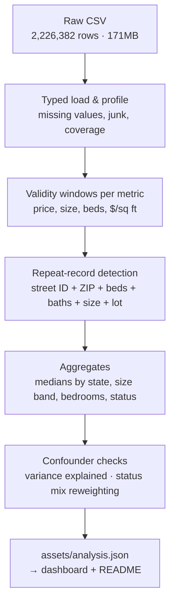

# USA Real Estate — Market & Data-Quality Analysis

**2,226,382 Realtor.com records · 12 columns · one 171MB CSV → $325K median price, $201 per sq ft, and a clear answer to what sets the price: ZIP code and size, not bedrooms.**


**[Open the live dashboard →](https://4maxr.github.io/USA-Real-Estate-Dataset/)** ·
[Portfolio case study](https://mostafaalrouby.com/projects/usa-real-estate.html)

A profile of the US housing market built from one raw export of 2.2 million listing
records — price, house size, bedrooms, geography, and status — cleaned with Python and
Pandas and published as an interactive dashboard. Every number on this page and in the
dashboard is written by `scripts/analyze_data.py` to `assets/analysis.json`.

> [!NOTE]
> **Why this stands out:** the data is messy in ways that change conclusions. Prices run
> from $0 to an int32 overflow (2,147,483,600); 5.8% of records repeat the same home; and
> "sold" and "for sale" prices come from different moments in the market. The analysis
> keeps every record, applies validity windows per metric, and tests each finding against
> the obvious confounder before stating it.

## Table of Contents

1. [Headline KPIs](#headline-kpis)
2. [Key Insights](#key-insights)
3. [What Changed in This Revision](#what-changed-in-this-revision)
4. [Dataset](#dataset)
5. [Data Quality](#data-quality)
6. [Method](#method)
7. [Business Recommendations](#business-recommendations)
8. [Repository Structure](#repository-structure)
9. [Quick Start](#quick-start)
10. [Interactive Dashboard](#interactive-dashboard)
11. [Known Limitations](#known-limitations)
12. [About the Author](#about-the-author)

---

## Headline KPIs

| KPI | Value | What it means |
|---|---|---|
| Records profiled | **2,226,382** | 12 columns · 30,334 ZIP codes · 30,567 city–state pairs |
| Median price | **$325,000** | Mean $523,069 — 61% higher; p99 $3.9M |
| Median price per sq ft | **$201** | From 1,655,723 records with a valid price and size |
| Status mix | **62.4% for sale** | 1,389,306 for sale · 812,009 sold · 25,067 ready to build |
| State spread | **4.8×** | California $669K vs Alaska $139.5K (52 places with ≥ 1,000 records) |
| What explains price | **ZIP 57% · size 31%** | State 20%, bedrooms 13% — and bedrooms just 0.5% once size is known |
| Repeat records | **129,792 (5.8%)** | Same home recorded twice, almost always as both for sale and sold |
| Missing house size | **25.5%** | Bedrooms 21.6% · bathrooms 23.0% missing |

## Key Insights

1. **The median is the market.** $325K median vs $523K mean — a 61% gap driven by a long
   right tail (p99 = $3.9M). Every figure uses medians and quantiles.
2. **Location sets the price — at the ZIP level.** ZIP code alone explains **56.9%** of the
   variation in log price, city 51.3%, house size 30.7%, state 20.4%, and bedrooms 13.3%
   (adjusted η², 1,634,907 records with valid price, size, and bedrooms). State medians span
   4.8× (California $669K, Alaska $139.5K), but states are too coarse: ZIP explains nearly
   three times as much.
3. **Size matters; bedroom count mostly restates it.** Price grows almost in proportion to
   size (log–log elasticity 0.97). After accounting for size, bedrooms explain **0.5%** of
   the remaining variation, while ZIP explains 69.3%.
4. **Price per sq ft is U-shaped.** $252 for homes under 1,000 sq ft, a low of **$191 at
   2,500–3,000 sq ft**, then back up to $313 at 7,500–10,000 sq ft. Mid-size homes are the
   best value per foot; big homes are not a bargain.
5. **The bedroom ladder is steep but not smooth.** Medians run $269K (1 bed) → $330K (3) →
   $459.9K (4) → $639K (5) → $950K (7), with near-identical steps of +39.4% (3→4) and +38.9%
   (4→5). Then 8-bedroom records ($749K) price *below* 7-bedroom ones.
6. **"Sold homes are pricier" is a mix effect.** Sold records have a higher median ($344.9K)
   than for-sale records ($305K), but sold is **lower at every bedroom count from 1 to 6**.
   California is 15.4% of sold records but 7.3% of for-sale ones. Weighted to the for-sale
   state mix, the sold median falls to $299K, and to $269.9K when bedrooms are matched too.
   Sold prices are also all from Oct 2021 – May 2022 transactions.
7. **Record volume tracks population, not demand.** Florida, California, and Texas hold
   30.8% of records — they are also the three most populous states. Without dates or
   per-capita data, counts measure the export's coverage, not market liquidity.

## What Changed in This Revision

The first version of this analysis (August 2026) reached several conclusions that did not
survive a closer test. They are corrected here and in the dashboard.

| Earlier claim | What the data shows | Why it changed |
|---|---|---|
| Price per sq ft *falls* as homes get bigger | U-shaped: falls to $191 at 2.5–3K sq ft, then rises to $313 | Earlier bands stopped at 3,000 sq ft; the full range reverses |
| Geography beats configuration: 3.8× state spread vs 3.5× bedroom spread | ZIP 56.9%, size 30.7%, state 20.4%, bedrooms 13.3% of variance explained | Max/min ratios depend on how many groups you pick; 3.8× came from the top-12 states only (all states: 4.8×) |
| Use the bedroom ladder as a pricing grid; 3→4 is *the* premium step | Bedrooms add 0.5% once size is known; 3→4 (+39.4%) and 4→5 (+38.9%) are tied | Bedrooms are a proxy for size |
| Sold listings skew toward higher-value homes | Sold is lower than for-sale at every bedroom count | Simpson's paradox: sold records over-represent California |
| Street is 99.5% numeric junk | Street is an encoded address ID (98.6% of IDs map to one ZIP) | Using it as a key exposes 129,792 repeat records |
| 0 exact duplicates | 0 exact, but 5.8% repeat the same home | Rows differ only in status or broker |
| Prices above $5B excluded (removing the overflow artifact) | The $2.1B overflow was still inside the $5B window | The ceiling is now $1B; the floor is $1,000 instead of $0 |
| 55 states | 50 states + DC + Puerto Rico + US Virgin Islands + Guam + 1 New Brunswick (Canada) record | Coverage checked value by value |
| Target Florida and Texas for liquidity | Removed | Listing counts follow population; the file cannot measure liquidity |

Headline medians did not move ($325K, $201/sq ft); the conclusions drawn from them did.

## Dataset

A single CSV export — `data/realtor-data.zip.csv` — identified by its file name as a
Realtor.com listing export. No source documentation ships with it, so formal provenance
beyond the file contents could not be confirmed. The CSV is kept locally and excluded from
GitHub because it exceeds the 100 MiB file limit; place your copy at
`data/realtor-data.zip.csv` to run the scripts.

| Column | Meaning | Data quality |
|---|---|---|
| `brokered_by` | Encoded broker / agency ID | 0.2% missing |
| `status` | for_sale · sold · ready_to_build | Complete |
| `price` | Asking price (for sale) or sale price (sold), USD | 0.07% missing · 280 at $0 · 1,226 under $1,000 · max 2,147,483,600 (int32 overflow) |
| `bed` / `bath` | Bedrooms / bathrooms | 21.6% / 23.0% missing · 725 / 401 values over 20 (max 473 / 830) |
| `acre_lot` | Lot size (acres) | 14.6% missing |
| `street` | Encoded street address ID | 0.5% missing · 2,001,358 IDs, 98.6% within one ZIP |
| `city` / `state` / `zip_code` | Location | Near-complete · `state` includes DC, 3 territories, and 1 Canadian record |
| `house_size` | Living area (sq ft) | 25.5% missing · 156 values over 50,000 (max 1,040,400,400) |
| `prev_sold_date` | Previous sale date; for sold records, the sale date | 67.0% present · every sold record dated Oct 2021 – May 2022 |

## Data Quality

- **Repeat records — 129,792 (5.8%).** Records sharing street ID, ZIP, beds, baths, house size,
  and lot size. 94.2% of these groups are one home recorded as both for sale and sold, and
  93.5% carry a single price. Headline medians barely move without them ($324,900 vs $325,000),
  so all records are kept and the issue is reported.
- **Placeholder and overflow prices.** 1,226 records under $1,000 (280 at $0) and 2 at $1B or
  more, including 2,147,483,600. Excluded from price metrics only.
- **Impossible sizes.** 156 house sizes above 50,000 sq ft; 725 bedroom and 401 bathroom
  counts above 20.
- **Two time frames.** Sold prices are Oct 2021 – May 2022 transactions; for-sale prices are
  asking prices at scrape time (not dated in the file). 15 `prev_sold_date` values fall outside
  1950–2025, including 3019-04-02.

## Method



- **Validity windows, not deletion.** Price $1,000 to under $1B; house size 100–50,000 sq ft;
  bedrooms 1–20; price per sq ft $1–$5,000. A record failing one window is excluded from that
  metric only — 99.88% of prices remain usable.
- **Medians throughout.** A median needs at least 30 records to be shown; a state needs
  1,000 records to be ranked.
- **Variance explained (adjusted η²).** The share of variance in log price explained by group
  means, adjusted for the number of groups. House size uses 20 equal-count bands; the
  "after size" figures apply the same measure to what those bands leave unexplained.
- **Status mix check.** Sold prices are reweighted to the for-sale distribution of states
  (and states × bedrooms) to separate composition from price level.
- **Self-checks.** The script asserts that histogram bins, size bands, and state totals add
  back up to their parent counts before writing any output.

## Business Recommendations

- **Report medians, never means.** A 61% mean–median gap means average-based benchmarks
  overstate the typical home. *(Insight 1)*
- **Comp at the ZIP level, not the state level.** ZIP explains 57% of price variation; state
  explains 20%. A state median is too coarse to price a home. *(Insight 2)*
- **Price on size and location; treat bedroom count as secondary.** Once size is known,
  bedrooms add 0.5%. A pricing grid built on bedrooms is a size grid in disguise. *(Insight 3)*
- **Do not assume big homes are cheaper per foot.** Price per sq ft bottoms out at
  2,500–3,000 sq ft and rises above it. *(Insight 4)*
- **Compare sold and for-sale prices like for like.** Match on location and configuration
  first; the raw sold premium is a composition effect. *(Insight 6)*
- **De-duplicate on the street key before counting homes.** 5.8% of records repeat a home.

## Repository Structure

```
USA-Real-Estate-Dataset/
├── data/
│   └── realtor-data.zip.csv    # local only · 2,226,382 rows · 12 columns
├── scripts/
│   ├── analyze_data.py         # profiling, KPIs, checks → assets/analysis.json
│   ├── build_pages_sample.py   # reproducible 50,000-record sample for the explorer
│   └── serve_dashboard.py      # local data service for full-dataset listing search
├── assets/
│   ├── analysis.json           # every dashboard and README number (generated)
│   ├── charts.js               # dependency-free SVG charts
│   ├── dashboard.js            # dashboard logic
│   ├── listings-sample.json    # 50,000-record sample (generated)
│   └── sample_explorer.js      # browser-side filtering for the explorer
├── dashboard/
│   └── index.html              # full-data listing search, served by serve_dashboard.py
├── index.html                  # GitHub Pages market dashboard
├── explorer.html               # GitHub Pages listing explorer (sample)
└── README.md
```

## Quick Start

Requires [uv](https://docs.astral.sh/uv/) and a local copy of the CSV at
`data/realtor-data.zip.csv`.

```bash
# 1. Create the environment and install dependencies
uv venv
uv pip install pandas numpy

# 2. Recompute every number and write assets/analysis.json
.venv/Scripts/python.exe scripts/analyze_data.py    # Windows
.venv/bin/python scripts/analyze_data.py            # macOS / Linux

# 3. Preview the dashboard
python -m http.server 8000                          # then open http://localhost:8000
```

## Interactive Dashboard

**[4maxr.github.io/USA-Real-Estate-Dataset](https://4maxr.github.io/USA-Real-Estate-Dataset/)**
is a static page that reads `assets/analysis.json`, so it shows exact full-dataset results
without a server. One geography filter scopes the market view (KPIs, price distribution,
price per sq ft by size, bedrooms, sold vs for sale, state ranking), and selecting a bar in
the state ranking applies it. A dataset-wide section shows what explains price and the data
quality issues. Every chart has hover and keyboard tooltips and a table view, and the page
follows your light or dark setting.

The **[listing explorer](https://4maxr.github.io/USA-Real-Estate-Dataset/explorer.html)**
filters a reproducible 50,000-record sample to browse individual listings. Regenerate the
sample with `scripts/build_pages_sample.py`. For exact listing search across all 2.2M
records, run `scripts/serve_dashboard.py` and open
[http://127.0.0.1:8765](http://127.0.0.1:8765).

## Known Limitations

- **Provenance could not be formally confirmed.** No source documentation ships with the CSV.
- **A snapshot, not a trend.** For-sale records carry no listing date; sold records cover a
  single seven-month window.
- **Mixed price types.** Asking prices and sale prices share one column; all-status medians
  blend them.
- **Repeat records are kept.** They barely move the medians but do inflate record counts and
  status shares.
- **Variance explained is in-sample.** Adjusted η² corrects for group count, but ZIP and city
  have thousands of groups and some with few records; treat the ranking, not the decimals, as
  the finding.
- **Validity windows are judgment calls**, documented in `scripts/analyze_data.py`.

## About the Author

**Mustafa Al-Rouby** — Data Analyst & Logistics Specialist with nine years in
international operations (customs clearance, supply chain, and process improvement).
This project applies the same lens the author brings to operations work: take the messy
export, find where the obvious numbers mislead, and deliver a decision-ready baseline.

- [Portfolio — USA Real Estate case study](https://mostafaalrouby.com/projects/usa-real-estate.html)
- [GitHub](https://github.com/4MaxR)
- [LinkedIn](https://www.linkedin.com/in/mustafa-al-rouby-20218b171)

---

<p align="center">Built for data-driven decisions. — Mustafa Al-Rouby</p>
